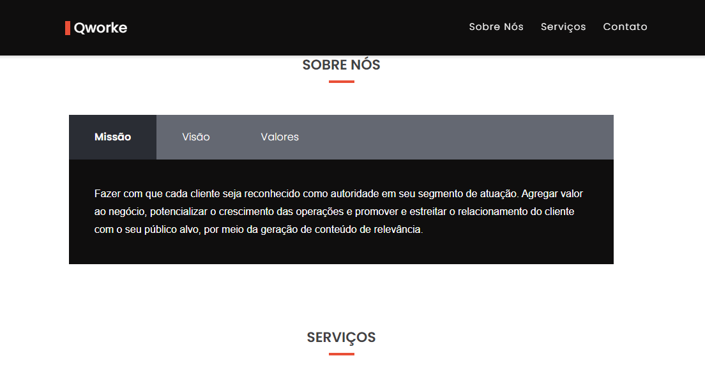
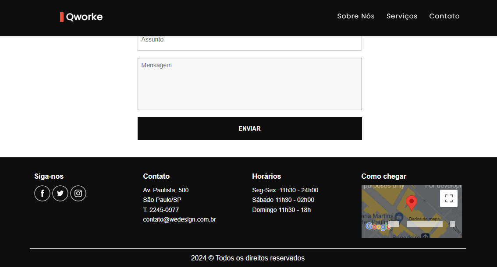

<h2>Web Site</h2>

<h3>Sobre</h3>

Site básico criado para empresas, com a parte de apresentação, os serviços oferecidos e a forma de contato. 
Uso do html, javascript e do sass com a extensão scss. 

<h4>Tecnologias &darr;</h4>

  
  
  

## Preview

  
   
  
   
  

  

